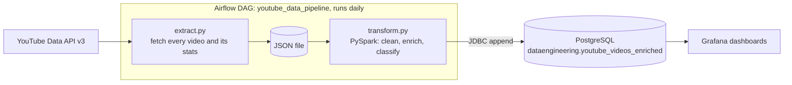

# YouTube Channel Analytics Pipeline

A daily data pipeline that pulls video statistics for a YouTube channel, cleans and enriches them with Apache Spark, and stores them in PostgreSQL for dashboards in Grafana. Apache Airflow runs the whole thing on a schedule.

## Architecture



## How it works

1. **Extract** (`extract.py`): finds the channel's uploads playlist, pages through every video, and saves the title, publish date, views, likes and comments to a JSON file with an extraction timestamp.
2. **Transform** (`transform.py`): loads the JSON into Spark, casts the counts to integers, and adds the publish year, month, day, weekday, hour and week. Each video also gets a performance class: `viral` (over 100,000 views), `high` (over 5,000) or `normal`.
3. **Load** (`transform.py`): creates the `dataengineering` schema and the `youtube_videos_enriched` table if they are missing, then appends the new rows over JDBC.
4. **Orchestrate** (`youtube_dags.py`): an Airflow DAG runs the extract task, then the transform and load task, once a day.
5. **Visualize**: Grafana reads the PostgreSQL table. The dashboards are built in Grafana and are not stored in this repository.

Because every run appends a fresh snapshot, the table keeps a history of how each video's numbers change over time.

## Run it

You need Python 3, Java (for Spark), a PostgreSQL database, a YouTube Data API key and Apache Airflow.

```bash
git clone https://github.com/Ambuso/Dw-Youtube-Channel-Analysis.git
cd Dw-Youtube-Channel-Analysis

python -m venv env
source env/bin/activate
pip install google-api-python-client python-dotenv pyspark psycopg2-binary
```

Create a `.env` file in the project folder:

```
YOUTUBE_API_KEY=your_api_key
YOUTUBE_CHANNEL_ID=your_channel_id
OUTPUT_FILENAME=youtube_raw.json

POSTGRES_USER=your_user
POSTGRES_PASSWORD=your_password
POSTGRES_HOST=your_host
POSTGRES_PORT=5432
POSTGRES_DB=your_database
POSTGRES_SSLMODE=require
```

Before the first run, change three paths to match your machine. They currently point at the server this project was built on (`/home/main/...`):

- `transform.py`: the PostgreSQL JDBC driver jar in `spark.jars`
- `transform.py`: the JSON file passed to `spark.read`, which must match `OUTPUT_FILENAME`
- `youtube_dags.py`: the Python interpreter and script paths in both `bash_command` lines

Then run the two steps by hand:

```bash
python extract.py
python transform.py
```

To schedule it, copy `youtube_dags.py` into your Airflow `dags/` folder and turn on the `youtube_data_pipeline` DAG.

## Output table

`dataengineering.youtube_videos_enriched`

| Column | Type | Meaning |
|---|---|---|
| videoId | text | YouTube video ID |
| title | text | Video title |
| publishedAt | timestamp | When the video was published |
| viewCount, likeCount, commentCount | int | Counts at extraction time |
| extractionTimestamp | timestamp | When the snapshot was taken |
| year, month, day_of_month, hour, week | int | Parts of the publish date |
| day_of_week | text | Weekday name of the publish date |
| performance_class | text | `viral`, `high` or `normal` |

## Files

```
extract.py        YouTube API to JSON
transform.py      Spark transform and load into PostgreSQL
youtube_dags.py   Airflow DAG
```

## Built with

Python, Apache Airflow, Apache Spark (PySpark), PostgreSQL, Grafana, YouTube Data API v3

## License

MIT
